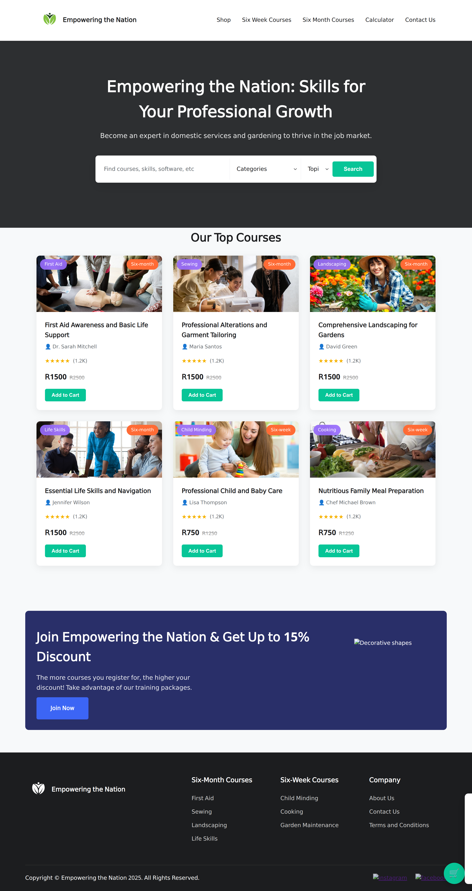
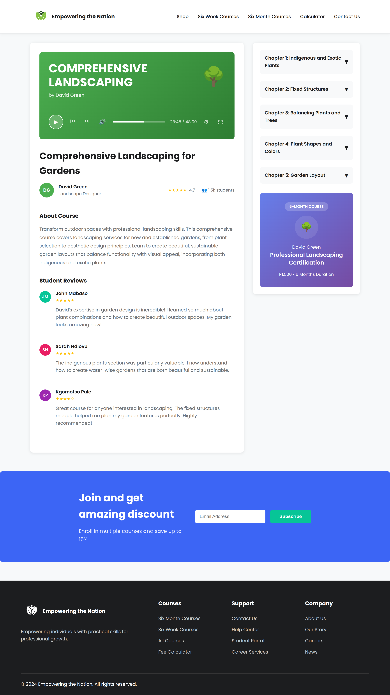

# Empowering the Nation 🌟

A comprehensive skills development platform offering professional training courses to empower individuals with practical skills for career growth and entrepreneurship.

## 👥 Project Contributors

This project was developed by:
- **Mazen Ba Hamid** - ST10486439
- **Zia Abdull** - ST10486244  
- **Osama Al Batati** - ST10477069

## 📖 Project Overview

Empowering the Nation is a modern, responsive website that provides access to professional training courses designed to equip individuals with valuable skills. The platform offers both 6-week and 6-month courses across various disciplines including healthcare, crafts, landscaping, life skills, and childcare.

## 🎯 Features

### 🏠 Homepage
- Modern, responsive design with hero section
- Featured courses showcase
- Interactive navigation
- Mobile-friendly layout

### 📚 Course Catalog
- **Six-Week Courses** (R750 each):
  - Child Minding
  - Cooking
  - Garden Maintenance

- **Six-Month Courses** (R1,500 each):
  - First Aid
  - Sewing
  - Landscaping
  - Life Skills

### 🎥 Individual Course Pages
Each course features:
- Interactive video player interface
- Detailed course descriptions
- Chapter-based curriculum with expandable sections
- Professional instructor profiles
- Student reviews and ratings
- Course pricing and duration information

### 🛒 Shop & Browse
- Complete course catalog
- Filter and search functionality
- Course comparison features
- Easy enrollment process

### 🧮 Fee Calculator
- Interactive cost calculator
- Multiple course selection
- Discount calculations for bulk enrollments
- VAT calculations
- Customer information form

### 📞 Contact Us
- Contact form with validation
- Business information
- Interactive elements
- Professional layout
## 🛠️ Technical Implementation

### Frontend Technologies
- **HTML5** - Semantic markup and structure
- **CSS3** - Modern styling with CSS Grid and Flexbox
- **JavaScript (ES6+)** - Interactive functionality and form validation
- **Responsive Design** - Mobile-first approach

### Architecture
- **Modular CSS** - Separate stylesheets for each page
- **Component-based JS** - Reusable JavaScript modules
- **External Assets** - Organized CSS and JS files in `/assets/` directory
- **Clean HTML** - Semantic structure with external resource linking

## 🎨 Design Features

### Visual Design
- **Modern UI/UX** - Clean, professional interface
- **Color-coded Courses** - Each course has unique branding colors
- **Interactive Elements** - Hover effects and smooth transitions
- **Professional Typography** - Google Fonts (Poppins)

### Responsive Design
- **Mobile-First** - Optimized for all device sizes
- **Flexible Layouts** - CSS Grid and Flexbox implementation
- **Touch-Friendly** - Mobile navigation and interactions
- **Cross-Browser** - Compatible with modern browsers

### User Experience
- **Intuitive Navigation** - Clear menu structure
- **Interactive Forms** - Real-time validation
- **Visual Feedback** - Loading states and success messages
- **Accessibility** - Semantic HTML and keyboard navigation
## 🖼️ Screenshot
<table>
  <tr>
    <td>Main Page</td>
    <td>Shop Page</td>
    <td>Course Page</td>
  </tr>
  <tr>
    <td></td>
    <td></td>
    <td></td>
  </tr>
</table>

## 💰 Course Pricing & Structure

### Six-Week Courses (R750 each)
1. **Child Minding** - Professional childcare training
2. **Cooking** - Nutritious meal preparation
3. **Garden Maintenance** - Domestic garden care

### Six-Month Courses (R1,500 each)
1. **First Aid** - Emergency response and basic life support
2. **Sewing** - Professional alterations and garment design
3. **Landscaping** - Comprehensive garden design
4. **Life Skills** - Essential life navigation skills

### Discount Structure
- **Multiple Course Enrollment** - Up to 15% discount
- **Bulk Registration** - Special rates for groups
- **Early Bird Pricing** - Seasonal promotions

## 🚀 Getting Started

### Prerequisites
- Modern web browser (Chrome, Firefox, Safari, Edge)
- No additional software installation required

### Running the Project
1. Clone or download the project files
 **Clone the repository**
   ```bash
   git clone https://github.com/Dragonz-XHAW/Website
   cd Website
   ```
2. Open `index.html` in your web browser
3. Navigate through the site using the menu
4. All functionality works locally without a server

### Development Setup
For development purposes:
1. Use a local web server (Live Server extension in VS Code recommended)
2. Edit HTML, CSS, and JS files as needed
3. Test responsiveness using browser developer tools

## 📱 Browser Support

- ✅ Chrome 70+
- ✅ Firefox 65+
- ✅ Safari 12+
- ✅ Edge 79+
- ✅ Mobile browsers (iOS Safari, Chrome Mobile)

## 🔧 Customization

### Adding New Courses
1. Update `db.json` with new course data
2. Create new HTML page using existing course templates
3. Add corresponding CSS and JS files in `/assets/`
4. Update navigation menus across all pages

### Styling Changes
- Modify CSS custom properties in `:root` for global color changes
- Individual page styles are in separate CSS files
- Responsive breakpoints can be adjusted in media queries

### Functionality Updates
- Course data is centralized in `db.json`
- JavaScript modules are separated by functionality
- Form validation can be customized in respective JS files

## 📊 Performance Features

- **Optimized Images** - Compressed and properly sized
- **Minified Assets** - Clean, efficient code
- **Fast Loading** - Optimized resource loading
- **SEO Friendly** - Proper meta tags and semantic HTML

## 🔒 Security Features

- **Form Validation** - Client-side and server-ready validation
- **Input Sanitization** - Protected against common vulnerabilities
- **Secure Practices** - Following web security best practices


**Built with ❤️ by the Dragonz Team** 
